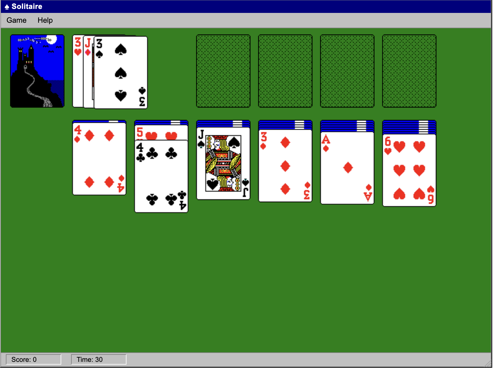

# Solitaire

Old-school Windows 3.1 Solitaire for web browser. No server-side or external
dependencies.

## Screenshot



## Run Locally

1. Open `index.html` in your browser.

## License

```
  Copyright 2026 Akop Karapetyan

  Licensed under the Apache License, Version 2.0 (the "License");
  you may not use this file except in compliance with the License.
  You may obtain a copy of the License at

      http://www.apache.org/licenses/LICENSE-2.0

  Unless required by applicable law or agreed to in writing, software
  distributed under the License is distributed on an "AS IS" BASIS,
  WITHOUT WARRANTIES OR CONDITIONS OF ANY KIND, either express or implied.
  See the License for the specific language governing permissions and
  limitations under the License.
```
